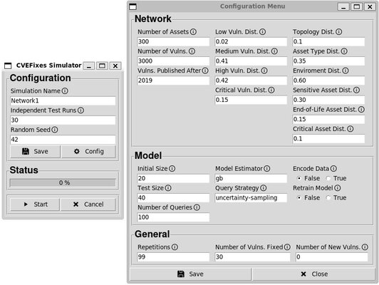

# Risk Assessment and Prioritization Simulator

The main objective of the simulator is to be a tool that offers the user the ability to compare different strategies for prioritizing and correcting security vulnerabilities. Thus, the main features of the simulator are:

- **Vulnerable network generation:** the simulator generates a fictitious computer network, according to context parameters previously established by the users, and with security vulnerabilities randomly selected from the NVD;
- **Classification of vulnerabilities:** the risk of exploiting security vulnerabilities is obtained using machine learning models that can be trained according to criteria established by the user;
- **Prioritization of vulnerabilities:** the simulator generates ordered lists of vulnerabilities following the defined classification criteria, to be used in the process of fixing security flaws;
- **Fixing vulnerabilities:** vulnerabilities are fixed, following the prioritization lists, until a certain number of iterations (i.e., classification, prioritization, and correction) has been reached;
- **Generation of insights:** at the end, comparative graphs are presented to the user, in such a way that the best strategy for managing vulnerabilities can be identified.

The simulator can be executed both from the command line and through a graphic interface specially developed for it. In the figure following, we can see the simulator configuration screens, with the various parameters that can be adjusted. 



## Requirements

Install requirements using the following command

```bash
$ pip install -r requirements.txt
```

## Execute

There are two ways to execute the risk assessment simulator.

### Without a GUI

To execute the simulator without a GUI use the following command

```bash
$ python main.py [-h] -r REP -c CONFIG [-s SEED]
```

Where the available options are:

- `-h`: show usage information
- `-r`: indicates the number of independent test round executed
- `-c`: path to the configuration file used in the simulation
- `-s`: seed used to generate random numbers

An example of a configuration can be found in the [config.ini](./config.ini) file.

### With a GUI

To execute the simulator with a GUI use the following command

```bash
$ python gui.py
```

## Output

The output of the simulation will be placed at the ``output`` folder.

## License

This project is [GNU GPLv3 licensed](./LICENSE).
